# Дипломный практикум в Yandex.Cloud
---
## Цели:

1. Подготовить облачную инфраструктуру на базе облачного провайдера Яндекс.Облако.
2. Запустить и сконфигурировать Kubernetes кластер.
3. Установить и настроить систему мониторинга.
4. Настроить и автоматизировать сборку тестового приложения с использованием Docker-контейнеров.
5. Настроить CI для автоматической сборки и тестирования.
6. Настроить CD для автоматического развёртывания приложения.

---
## Этапы выполнения:


### Step 1 - Создание облачной инфраструктуры
Ожидаемые результаты:

1. Terraform сконфигурирован и создание инфраструктуры посредством Terraform возможно без дополнительных ручных действий, стейт основной конфигурации сохраняется в бакете или Terraform Cloud

### Решение

```bash
# Инициализируем переменные проекта
source init.sh

# Очистка переменных проекта
source destroy.sh
```
заходим в папку проекта TF-createS3backend и запускаем terraform plan
создается бакет, сервисный аккаунт для доступа к бакету, получаем ключи доступа к бакету
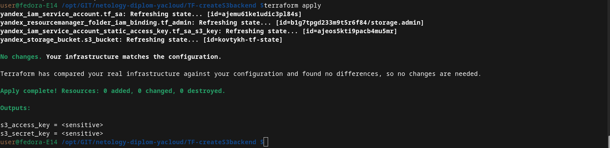

для выводы в читаемом виде выполняем
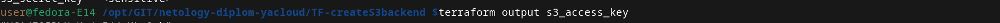

заполняем недостающие переменные в init.sh -  инициализируем.

результат выполнения - выделенный backet для хранения tfstate ифраструктуры

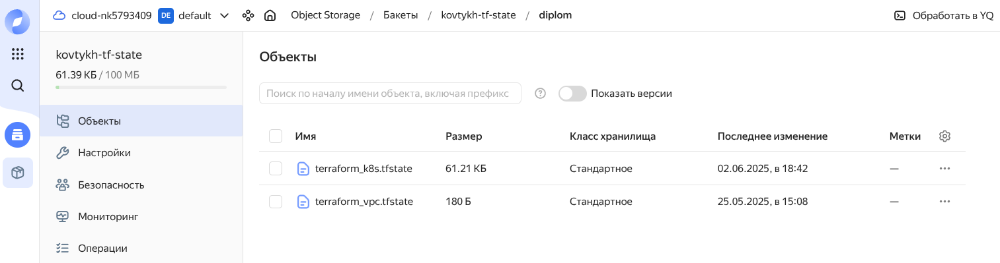

---
### Step 2 - Создание Kubernetes кластера

Ожидаемый результат:

1. Работоспособный Kubernetes кластер.
2. В файле `~/.kube/config` находятся данные для доступа к кластеру.
3. Команда `kubectl get pods --all-namespaces` отрабатывает без ошибок.

### Решение
заходим в папку проекта TF-yandex-k8s-vps и запускаем terraform plan

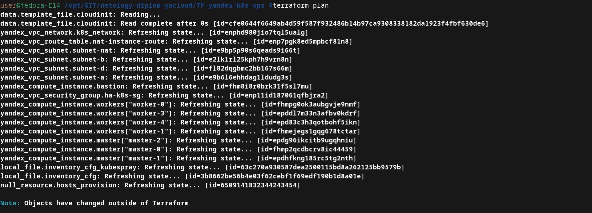

создаются необходимые ресуры

сеть и подсети в разных регионах
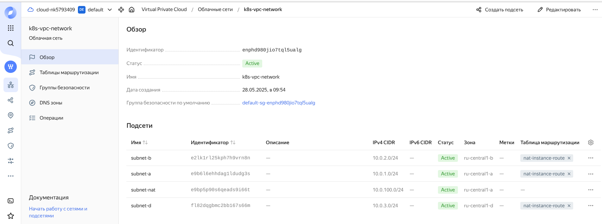

настройка групп безопастности
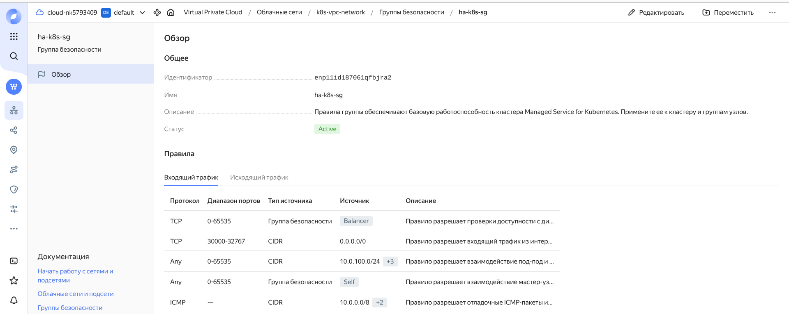

master vps - 3 шт.
worker vps - 4 шт.
bastion vps - поскольку кластер изолирован, бастион хост будет выполнять роль точки входа и выхода.

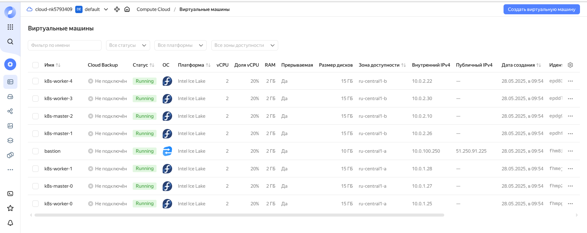

в процессе выполнения terraform, будет сгенерирован файл в папке проекта hosts_kubespray.txt

в дальшейшем потребуется для инсталяции k8s через ansible kubespray

клонируем репозиторий kubespray в удобную папку

```bash
git clone https://github.com/kubernetes-sigs/kubespray.git
cd kubespray
pip install -r requirements.txt

# hosts_kubespray.txt - файл inventory для kubespray генерирует terraform
ansible-playbook  cluster.yml -i hosts_kubespray.txt --extra-vars "cluster_name=my-cluster.prod" -b
```
результат запуска kubespray - выполнение заняло 25-30 минут

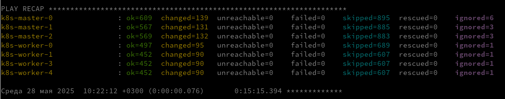

```bash
# подключаемся на любую master node
ssh -J user@bastion_host_ip user@master_node_ip
```

выводим параметры доступа к k8s

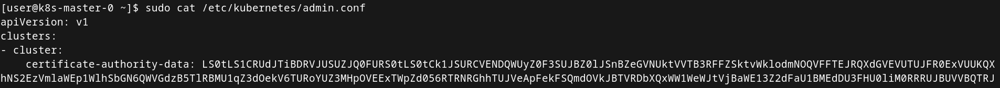

на пк который будет использоваться для управления кластером k8s
```bash
# создаем папку в домашнем каталоге
mkdir -p ~/.kube

# и переносим содержимое [user@k8s-master-0 ~]$ sudo cat /etc/kubernetes/admin.conf

# если работаем в bastion host  меняем ip адрес master node
nano ~/.kube/config

# если работаем с локального пк достаточно сделать проброс портов
nano ~/.kube/config # копируем содержимое /etc/kubernetes/admin.conf как есть
ssh -L 6443:master_node_ip:6443 user@bastion_host_ip -N

```
```bash
# устанавливаем kubectl и helm
# для примера на Linux
# kubectl
curl -LO https://storage.googleapis.com/kubernetes-release/release/${K8S_VERSION}/bin/linux/amd64/kubectl 
chmod +x kubectl
kubectl version --client
```

результат - кластер в доступе 

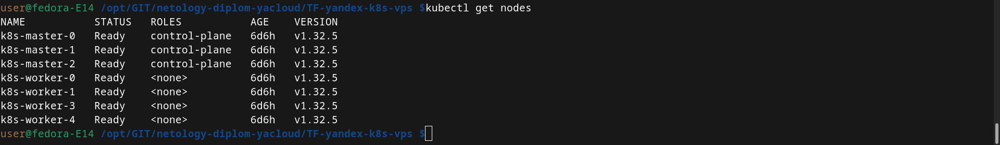


---
### Step 3 - Создание тестового приложения
Ожидаемый результат:

1. Git репозиторий с тестовым приложением и Dockerfile.
2. Регистри с собранным docker image. В качестве регистри может быть DockerHub или [Yandex Container Registry](https://cloud.yandex.ru/services/container-registry), созданный также с помощью terraform.

Репозиторий приложения
```https://github.com/5793409/docker-app```

Регистри docker image на Docker Hub
 ```docker pull wisebeard/docker_app-custom```


---
### Step 4 - Подготовка cистемы мониторинга и деплой приложения

Подготовка

```bash
# Ставить мониторинг будем через Helm Chart

# Ставим helm
wget https://get.helm.sh/helm-v3.18.2-linux-amd64.tar.gz
# распаковать
tar zxpf helm-v3.18.2-linux-amd64.tar.gz
# даем права на выполнение и проверяем версию
chmod +x helm
helm version

# качаем заготовки
git clone git@github.com:5793409/k8s-tools.git
cd k8s-tools

# поскольку мониторинг и приложение должны быть доступны через интернет
# подключаем репозиторий Ingress
helm repo add ingress-nginx https://kubernetes.github.io/ingress-nginx

# подключаем репозиторий Monitoring
helm repo add prometheus-community https://prometheus-community.github.io/helm-charts

# обновляем данные
helm repo update
```

Запуск

```bash
# Ставим Ingress
helm install ingress-nginx ingress-nginx/ingress-nginx \
  --namespace ingress-system --create-namespace \
  --set controller.service.type=NodePort \
  --set controller.service.nodePorts.http=30080

# Ставим мониторинг 
# в данном примере Load Balancer`ом является Bastion host
# правим параметр root_url: "http://bastion_external_ip/grafana/" в
# my_setup_value.yaml из github.com:5793409/k8s-tools.git
helm install monitoring prometheus-community/kube-prometheus-stack \
  --namespace monitoring \
  --create-namespace \
  -f my_setup_value.yaml 

# запуск ingress-grafana
kubectl apply -f ingress-grafana.yaml

# запуск приложения
kubectl apply -f docker-app-3-in-1.yaml
```
Запускаем балансировщик на Bastion Host

```bash
# Установка HAproxy стандартная apt/yum install haproxy


# Направляем балансировщик на worker nodes
root@bastionhost:~# vim /etc/haproxy/haproxy.cfg 

# Фронтенд (принимает входящие запросы)
frontend http_front
    bind *:80
#    bind *:443 ssl crt /etc/haproxy/certs/example.com.pem  # Если используете HTTPS
#    http-request redirect scheme https unless { ssl_fc }   # Редирект HTTP → HTTPS
    default_backend http_back

# Бэкенд (распределяет нагрузку между серверами)
backend http_back
    balance source  # Алгоритм балансировки (можно заменить на leastconn, source и др. roundrobin)
    server vps1 10.0.1.25:30080 # check maxconn 1000
    server vps2 10.0.1.28:30080 check maxconn 1000
    server vps3 10.0.2.22:30080 check maxconn 1000
    server vps4 10.0.2.30:30080 check maxconn 1000
    option httpchk GET /health  # Проверка работоспособности (если есть /health)

root@bastionhost:~# 

#Запускаем haproxy на bastion host
sudo systemctl enable haproxy --now
```


Результат

### Активный мониторинг

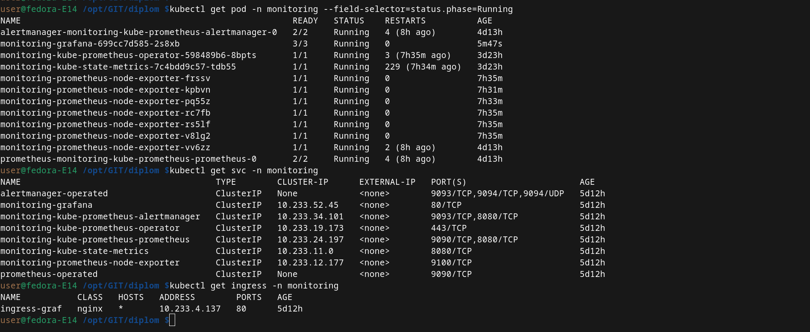

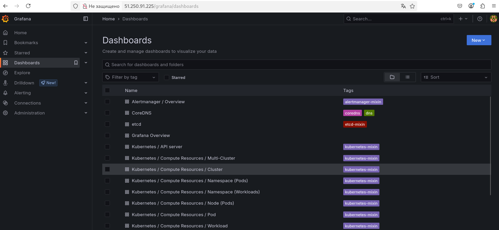

### Активное приложение

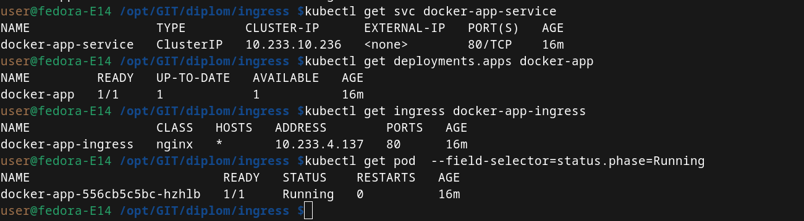

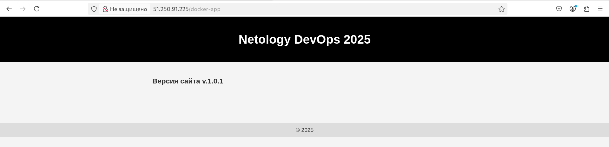


---
### Step 5 - Деплой инфраструктуры в terraform pipeline


Ожидаемый результат:
1. Git репозиторий с конфигурационными файлами для настройки Kubernetes.
2. Http доступ на 80 порту к web интерфейсу grafana.
3. Дашборды в grafana отображающие состояние Kubernetes кластера.
4. Http доступ на 80 порту к тестовому приложению.
5. Atlantis или terraform cloud или ci/cd-terraform


---
### Step 6 - Установка и настройка CI/CD

Ожидаемый результат:

1. Интерфейс ci/cd сервиса доступен по http.
2. При любом коммите в репозиторие с тестовым приложением происходит сборка и отправка в регистр Docker образа.
3. При создании тега (например, v1.0.0) происходит сборка и отправка с соответствующим label в регистри, а также деплой соответствующего Docker образа в кластер Kubernetes.

делаем commit и отправляем в github

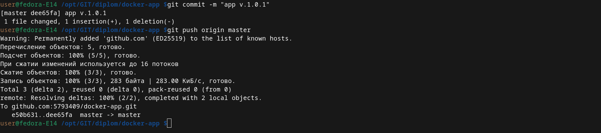

отработка CI

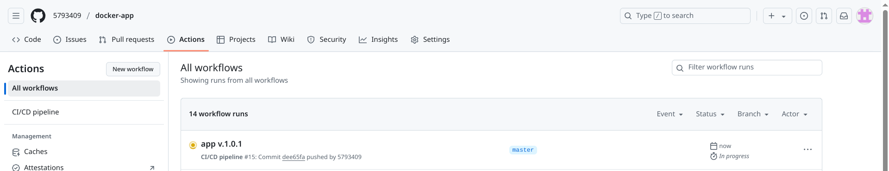

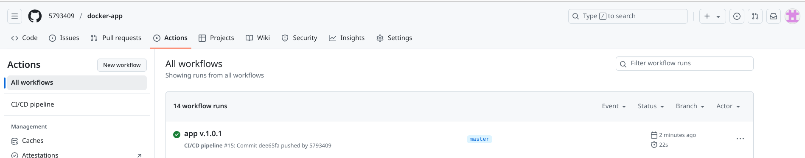

Сборка docker образа прошла успешно

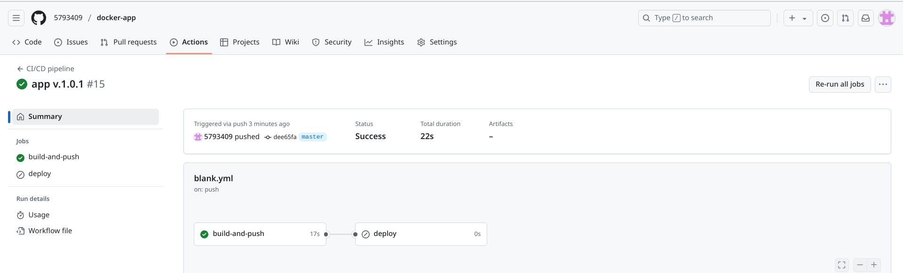

Проверяем в docker hub`e

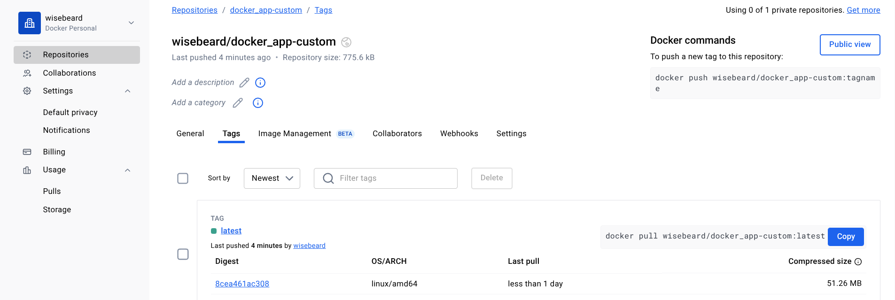


Меняем версию сайта

Делаем commit, добавляем tag, делаем загрузку в github

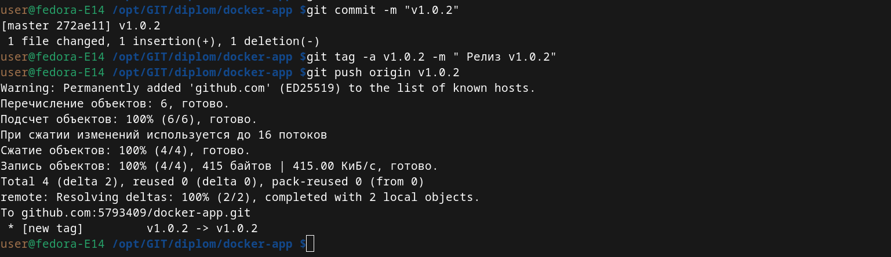

Автоматическая отработка CI/CD pipeline c перезагрузкой контейнера в k8s

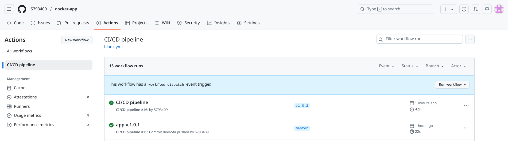

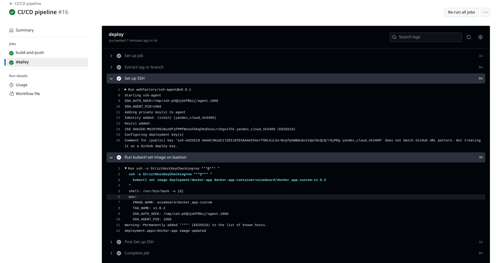

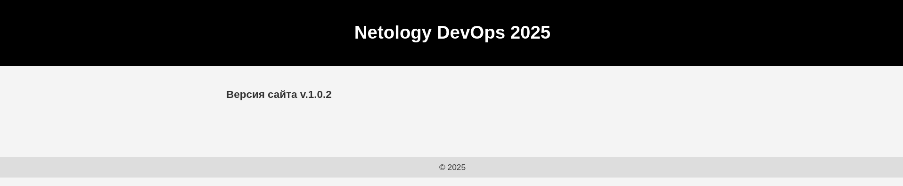

---
## Что необходимо для сдачи задания?

1. Репозиторий с конфигурационными файлами Terraform и готовность продемонстрировать создание всех ресурсов с нуля.
2. Пример pull request с комментариями созданными atlantis'ом или снимки экрана из Terraform Cloud или вашего CI-CD-terraform pipeline.
3. Репозиторий с конфигурацией ansible, если был выбран способ создания Kubernetes кластера при помощи ansible.
4. Репозиторий с Dockerfile тестового приложения и ссылка на собранный docker image.
5. Репозиторий с конфигурацией Kubernetes кластера.
6. Ссылка на тестовое приложение и веб интерфейс Grafana с данными доступа.
7. Все репозитории рекомендуется хранить на одном ресурсе (github, gitlab)
